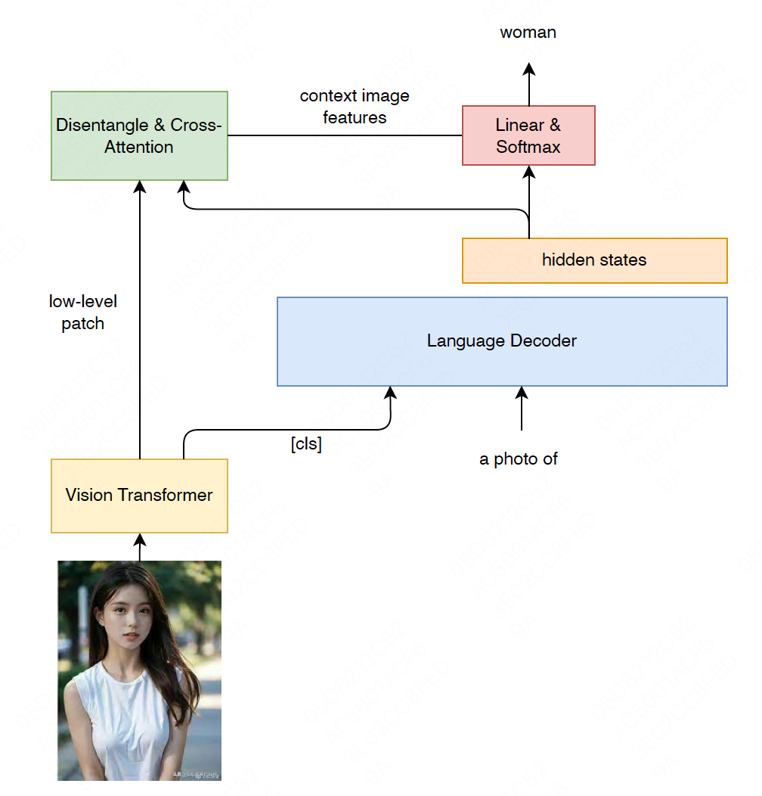

## All In One: General Multimodal Large Language Model

This reporsitory introduce a new visual information incorporation strategy, referred to as "Recall" mechanism for multimoldal language model. What's more, the model additionly supports CV tasks including detection, segementation and more. 

     
      
     <em>
     Overview of the proposed AIO framework.
    </em>

